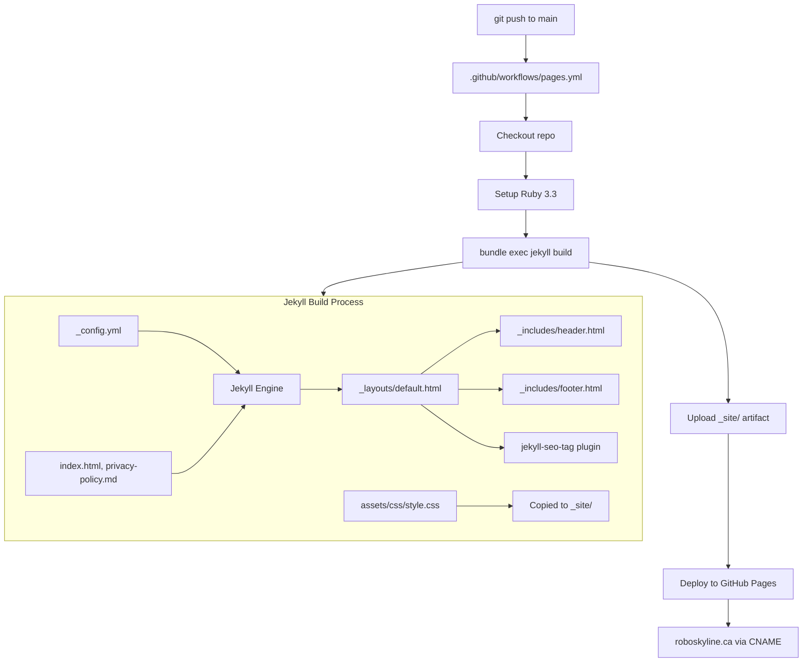

# Robo Skyline -- System Design Overview

## Project Summary

Robo Skyline is a static **Jekyll 4.x** brochure website for a software solutions company. It is deployed to **GitHub Pages** via a custom GitHub Actions workflow and served at the custom domain **roboskyline.ca**.

Key constraints:
- No JavaScript anywhere in the site.
- No pre-built Jekyll theme gem -- all layouts and styling are custom.
- No SCSS -- plain CSS only, using CSS custom properties for theming.
- Only two content pages: homepage and privacy policy.
- No `_data/`, collections, or blog posts.

## Architecture



## File Map

```
Robo-Skyline/
├── .github/
│   └── workflows/
│       └── pages.yml              # GitHub Actions: build + deploy to Pages
├── _includes/
│   ├── header.html                # Sticky nav bar with logo image, CSS-only mobile hamburger
│   └── footer.html                # Logo, contact email, copyright, privacy link
├── _layouts/
│   └── default.html               # Single HTML5 layout shell (head, seo, fonts, favicon, header, main, footer)
├── assets/
│   ├── css/
│   │   └── style.css              # All styling (~500 lines, CSS custom properties, responsive)
│   └── images/
│       └── logo.png               # Robo Skyline logo (used in header, hero, footer, favicon)
├── _config.yml                    # Jekyll config (url, baseurl, plugins)
├── Gemfile                        # Jekyll ~> 4.3, jekyll-seo-tag
├── Gemfile.lock                   # Locked dependency versions
├── CNAME                          # Custom domain: roboskyline.ca
├── index.html                     # Homepage (hero with logo, services cards, contact CTA)
├── privacy-policy.md              # Privacy policy content page
├── .gitignore                     # Ignores _site/, .jekyll-cache, vendor/, etc.
└── README.md
```

## Rendering Chain

Each page follows this rendering path:

1. Jekyll reads the page's front matter (`layout: default`, `title`, `permalink`).
2. The page content is rendered (Markdown via kramdown, or raw HTML).
3. Content is injected into `_layouts/default.html` at `{{ content }}`.
4. The layout includes `_includes/header.html` and `_includes/footer.html`.
5. `jekyll-seo-tag` generates `<meta>`, Open Graph, and JSON-LD tags in `<head>`.
6. `assets/css/style.css` is linked in the `<head>` and copied as-is to `_site/`.
7. Google Fonts (Rajdhani, Inter) are loaded via `<link>` tags in `<head>`.
8. A favicon (`assets/images/logo.png`) is referenced in `<head>`.

## Key Implementation Caveats

### No theme gem
All styling lives in `assets/css/style.css`. There is no `theme:` key in `_config.yml`. Do not add one or attempt to install a theme gem.

### CSS-only mobile navigation
The hamburger menu uses a hidden `<input type="checkbox">` with CSS sibling selectors (`.nav-toggle:checked ~ .site-nav`). The breakpoint is `max-width: 640px`. There is no JavaScript toggle logic.

### Jekyll 4.x with custom GitHub Actions (not the github-pages gem)
The `Gemfile` pins `jekyll ~> 4.3` directly rather than using the `github-pages` gem. Deployment is handled by `.github/workflows/pages.yml`, not the legacy GitHub Pages Jekyll integration. This gives access to Jekyll 4.x features and newer plugin versions.

### Custom domain and CNAME
The `CNAME` file contains `roboskyline.ca`. The `url` field in `_config.yml` must stay in sync with this value (`https://roboskyline.ca`). If the domain changes, update both files.

### SEO via jekyll-seo-tag
The `jekyll-seo-tag` plugin auto-generates meta tags from `_config.yml` fields (`title`, `description`, `url`) and per-page front matter (`title`). Every content page should include a `title` in its front matter.

### Permalink style
`_config.yml` sets `permalink: pretty`, which produces clean URLs (e.g., `/privacy-policy/` instead of `/privacy-policy.html`).

### Baseurl is empty
`baseurl: ""` in `_config.yml` because the site is served at the domain root, not a subdirectory. All `relative_url` filter outputs resolve from `/`.

## Deployment Flow

1. Push (or merge) to `main` triggers `.github/workflows/pages.yml`.
2. The workflow checks out the repo, sets up Ruby 3.3 with bundler cache.
3. `bundle exec jekyll build` runs with `JEKYLL_ENV: production`.
4. The `_site/` directory is uploaded as a Pages artifact.
5. A second job deploys the artifact to GitHub Pages.
6. The `CNAME` file tells GitHub Pages to serve from `roboskyline.ca`.

No manual CI/CD setup is needed beyond the workflow file already in the repo.

## Design Tokens (CSS Custom Properties)

All themeable values are defined as CSS custom properties on `:root` in `assets/css/style.css`. The palette is derived from the Robo Skyline logo (retro-futuristic, mid-century industrial aesthetic with red accents, light blue backgrounds, and warm cream tones).

| Token | Value | Purpose |
|---|---|---|
| `--color-bg` | `#f0f4f8` | Page background (soft light blue, matching logo background) |
| `--color-bg-alt` | `#e8ddd0` | Alternate section background (warm cream, from logo tones) |
| `--color-text` | `#1a1a2e` | Primary text color (dark navy) |
| `--color-text-muted` | `#4a4a5a` | Secondary/body text |
| `--color-primary` | `#c0392b` | Accent color -- red (links, buttons, card borders, dividers) |
| `--color-primary-hover` | `#a93226` | Accent hover state (darker red) |
| `--color-dark` | `#0d0d12` | Header and footer background (near-black) |
| `--color-dark-text` | `#e2e0dc` | Text on dark backgrounds (warm off-white) |
| `--color-border` | `#d0c8be` | Border/divider color (warm tone) |
| `--color-accent-light` | `#b8cfe0` | Soft blue highlight color |
| `--font-heading` | `"Rajdhani", ...` | Heading font (geometric/industrial, loaded via Google Fonts) |
| `--font-body` | `"Inter", ...` | Body font (clean sans-serif, loaded via Google Fonts, with system fallbacks) |
| `--max-width` | `960px` | Content container max width |
| `--space-xs` | `0.5rem` | Extra-small spacing |
| `--space-sm` | `1rem` | Small spacing |
| `--space-md` | `2rem` | Medium spacing |
| `--space-lg` | `4rem` | Large spacing |
| `--space-xl` | `6rem` | Extra-large spacing |

## CSS Class Reference

Key classes used across pages (defined in `assets/css/style.css`):

- `.container` -- max-width wrapper with horizontal padding
- `.site-header` / `.header-inner` -- sticky top navigation bar with red bottom border
- `.wordmark` -- logo image + company name link in the header (flex layout)
- `.logo-img` -- logo image in the header (44px height)
- `.site-nav` -- horizontal nav link list with red underline hover effect (collapses on mobile)
- `.nav-toggle` / `.nav-toggle-label` -- CSS-only hamburger menu
- `.hero` -- full-width hero section with centered logo and text, red accent bar via `::after`
- `.hero-logo` -- large centered logo in hero section (220px width)
- `.services` / `.services-grid` / `.service-card` -- services section with CSS Grid cards; cards have 4px red left border and hover lift effect
- `.contact` / `.btn` -- contact CTA section with red styled button (uppercase, Rajdhani font)
- `.site-footer` / `.footer-inner` -- dark footer with red top border and flex layout
- `.footer-brand` / `.footer-logo` -- logo + copyright grouping in footer (36px logo)
- `.page-content` -- wrapper for non-homepage content (privacy policy); h2 elements use red bottom border
